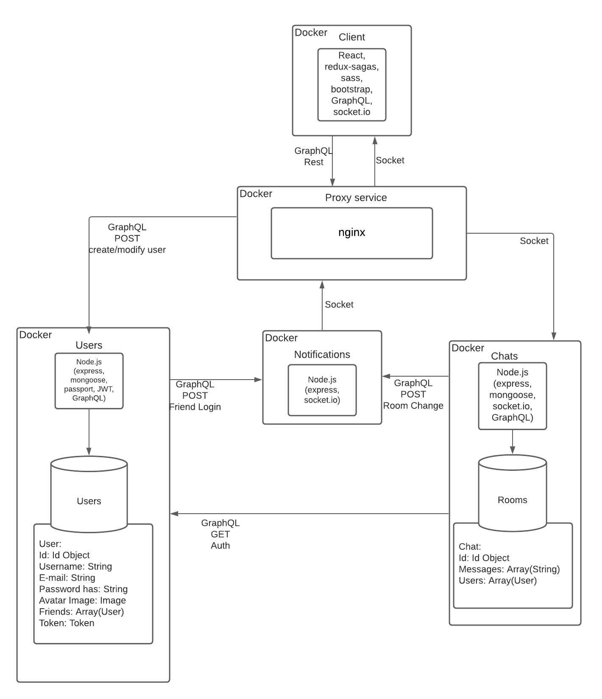

# chatApp
This is a web app in which a user can add contacts, chat in one to one conversations and chat in group rooms. To use the app it is necessary to register by giving a user name,  email, password and, optionally, an avatar picture.
## Setup
The app is formed by 4 services:  users, chats, notifications, and client. The services are (will be) mounted in their own docker container and the communication is through an Nginx proxy service. 

 {:height="36px"
### Required Technologies (so far)
* Chats:
	- node
	- express: ^4.17.1
	- mongoose: ^6.0.7
	- socket.io: ^4.2.0
* Users:
	- bcryptjs: ^2.4.3
	- express: ^4.17.1
	- express-session: ^1.17.2
	- jsonwebtoken: ^8.5.1
	- mongoose: ^5.13.7
	- multer: ^1.4.3
	- passport: ^0.4.1
	- passport-local: ^1.0.0
	- sharp: ^0.29.0
	- validator: ^13.6.0
* Client:
	-	axios: ^0.21.1
	-	multer: ^1.4.3
	-	react: ^17.0.2
	-	react-dom: ^17.0.2
	-	react-flash-message: ^1.0.7
	-	react-hook-form: ^7.13.0 (I think I am not using this)
	-	react-router-dom: ^5.2.0
	-	socket.io-client: ^4.2.0

### Mongo db
If you install the db in a folder, downloads for example, you can start it with:
/home/javier/Downloads/mongodb/bin/mongod --dbpath=/home/javier/Downloads/mongodb-data

### Nginx
To start nginx in localhost,  sudo service nginx start
In the file /etc/nginx/sites-available/default, after 
```
server_name _;

	location / {
		# First attempt to serve request as file, then
		# as directory, then fall back to displaying a 404.
		try_files $uri $uri/ =404;
	}
```
add the following

```

	location ~ \.s?css$ {
		proxy_pass http://localhost:1234;
	}

	location ~ \.png$ {
                proxy_pass http://localhost:1234;
        }


	location ~ \.map$ {
		proxy_pass http://localhost:1234;
	}

	location ~ \.jsx?$ {
		proxy_pass http://localhost:1234;
	}
	
	location ~ \/chat\/.* {
		proxy_pass http://localhost:1234;
	}

	location ~ \/users\/.* {
		proxy_pass http://localhost:3000;
	}

	location ~ \/chats\/.* {
                proxy_pass http://localhost:3001;
        }

	#location ~ \/socket\.io\/.* {
        #        proxy_pass http://localhost:3001;
        #}

	location /mysocket/ {
     		proxy_pass http://localhost:3001; 
      		proxy_http_version 1.1;
      		proxy_set_header Upgrade $http_upgrade;
      		proxy_set_header Connection 'upgrade';
      		proxy_set_header Host $host;
      		proxy_cache_bypass $http_upgrade;
    	} 

```

### Environment Variables
- (I have not implemented them yet)

 ### Ports
 - 3000: Service users.
 - 3001: Service chats.
 - 1234: Service client.